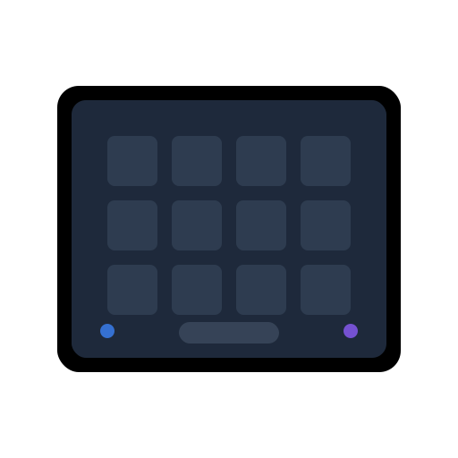

<p align="center">
  
</p>

# Loupedeck Linux

[](https://opensource.org/licenses/MIT)
[](https://nodejs.org)
[](https://pnpm.io)

[English](./README.md) | [日本語](./README.ja.md)

Linux向けのLoupedeckデバイスコントローラー。Web UIで直感的に設定できる、オープンソースのデバイス管理アプリケーションです。

## 🌟 特徴

- 🎮 **対応デバイス**: Loupedeck Live S（他デバイスは動作未確認）
- 🖥️ **タッチスクリーン**: 5×3グリッドレイアウトでカスタムボタンを配置可能
- 💡 **LEDコントロール**: 物理ボタンの色をカスタマイズ
- 🎚️ **ノブ操作**: 音量調整・メディア制御を直感的に操作可能
- 🚀 **アプリケーションランチャー**: よく使うアプリをワンタップで起動
- 🌐 **Web UI**: モダンな設定画面（React + Vite + TailwindCSS v4）
- ⚡ **ホットリロード**: 設定変更を即座に反映

## 📁 プロジェクト構成

pnpm workspacesを使用したモノレポ構成です：

```
loupedeck-linux/
├── apps/
│   ├── backend/           # バックエンド (@loupedeck-linux/backend)
│   │   ├── main.ts       # エントリーポイント
│   │   ├── src/          # ソースコード
│   │   └── config/       # ランタイム設定
│   └── web/              # フロントエンド (React + Vite)
├── docs/                  # 詳細ドキュメント
├── scripts/               # 管理スクリプト
├── package.json          # ルート設定
└── pnpm-workspace.yaml   # ワークスペース定義
```

## 📋 必須要件

### システム要件

- Linux（Arch Linuxで動作確認済み）
- Node.js 20以上
- pnpm 9以上
- Loupedeck Live S（その他のデバイスは動作未確認）

### システムパッケージ

```bash
# Arch Linux
sudo pacman -S nodejs pnpm libusb

# Ubuntu/Debian
sudo apt install nodejs npm libusb-1.0-0-dev
npm install -g pnpm
```

### udevルール設定

Loupedeckデバイスへのアクセス権限を設定：

```bash
sudo tee /etc/udev/rules.d/50-loupedeck.rules > /dev/null <<EOF
SUBSYSTEM=="usb", ATTR{idVendor}=="2ec2", ATTR{idProduct}=="0004", MODE="0666"
EOF

sudo udevadm control --reload-rules
sudo udevadm trigger
```

### オプション依存パッケージ

```bash
# Arch Linux
sudo pacman -S pamixer playerctl wtype

# Ubuntu/Debian
sudo apt install pamixer playerctl wtype
```

## 🚀 クイックスタート

```bash
# リポジトリをクローン
git clone https://github.com/archfill/loupedeck-linux.git
cd loupedeck-linux

# 依存関係をインストール
pnpm install

# バックエンド + Web UIを同時起動
pnpm run dev:all
```

ブラウザで http://localhost:5173 にアクセスしてWeb UIを開いてください。

## 🔧 詳細セットアップ

### システムパッケージのインストール

```bash
# Arch Linux
sudo pacman -S nodejs pnpm libusb pamixer playerctl wtype

# Ubuntu/Debian
sudo apt install nodejs npm libusb-1.0-0-dev pamixer playerctl wtype
npm install -g pnpm
```

### udevルールの設定

Loupedeckデバイスへのアクセス権限を設定：

```bash
sudo tee /etc/udev/rules.d/50-loupedeck.rules > /dev/null <<EOF
SUBSYSTEM=="usb", ATTR{idVendor}=="2ec2", ATTR{idProduct}=="0004", MODE="0666"
EOF

sudo udevadm control --reload-rules
sudo udevadm trigger
```

### アプリケーションのインストール

```bash
# リポジトリをクローン
git clone https://github.com/archfill/loupedeck-linux.git
cd loupedeck-linux

# 依存関係をインストール
pnpm install

# スクリプトに実行権限を付与
chmod +x scripts/*.sh
```

## 💻 開発

```bash
# バックエンドのみ起動
pnpm run dev

# Web UIのみ起動
pnpm run dev:web

# バックエンド + Web UIを同時起動
pnpm run dev:all
```

### その他のコマンド

```bash
pnpm start              # プロダクションモードで起動
pnpm run build:web      # Web UIをビルド
pnpm run lint           # リンター実行
pnpm run format         # フォーマッター実行
```

## 🚀 本番環境での自動起動

### systemdサービスのインストール

**要件**: pnpmがシステムPATHに含まれている必要があります

```bash
# pnpmをグローバルにインストール（まだの場合）
npm install -g pnpm

# Web UIをビルド（本番環境で必要）
pnpm run build:web

# サービスをインストール
pnpm run service:install
```

**動作**:

- ログイン時に自動起動
- ログアウト時に自動停止
- GUI環境変数はセッションから継承
- バックエンドがAPIとWeb UIの両方を配信（http://localhost:9876）

> **Hyprlandユーザー向け**: 環境変数をsystemdユーザーセッションにエクスポートする必要があります。`hyprland.conf`の他の`exec-once`より前に以下を追加してください：
>
> ```
> exec-once = dbus-update-activation-environment --systemd WAYLAND_DISPLAY XDG_CURRENT_DESKTOP XDG_DATA_DIRS HYPRLAND_INSTANCE_SIGNATURE PATH
> ```
>
> GNOMEやKDE Plasmaはこれを自動的に行いますが、Hyprlandでは手動設定が必要です。この設定がないと、アイコンの検出やHyprland固有の機能（`hyprctl`によるワークスペース切替など）が動作しません。

### サービスの管理

```bash
pnpm run service:status    # ステータス確認
pnpm run service:stop      # 停止
pnpm run service:restart   # 再起動
pnpm run service:logs      # ログ確認
pnpm run service:uninstall # 削除
```

## 📖 使い方

### デバイスレイアウト

#### タッチスクリーングリッド（5列×3行）

```
列:     0           1           2           3           4
行0: [時計]     [Firefox]  [1Password] [Thunderbird] [ ]
行1: [Setup]    [ ]        [Unlock]    [ ]           [ ]
行2: [ ]        [ ]        [ ]         [ ]           [ ]
```

#### ノブ

| ノブ             | 回転          | クリック      |
| ---------------- | ------------- | ------------- |
| knobTL（左上）   | 音量調整      | ミュート切替  |
| knobCL（左中央） | 次/前トラック | 再生/一時停止 |

### Web UI

- 開発: http://localhost:5173
- API: http://localhost:9876/api/config

## ⚙️ 設定

ランタイム設定は `apps/backend/config/config.json` で管理されます。
設定変更はホットリロードで即座に反映されます。

## API エンドポイント

| エンドポイント               | 説明               |
| ---------------------------- | ------------------ |
| `GET /api/health`            | ヘルスチェック     |
| `GET /api/config`            | 全設定             |
| `GET /api/config/components` | コンポーネント設定 |
| `GET /api/config/constants`  | システム定数       |
| `GET /api/device`            | デバイス情報       |

## 📚 ドキュメント

詳細なドキュメントは `docs/` ディレクトリを参照：

- [architecture.md](docs/architecture.md) - アーキテクチャ詳細
- [component-guide.md](docs/component-guide.md) - コンポーネント作成ガイド
- [api-reference.md](docs/api-reference.md) - API リファレンス
- [patterns.md](docs/patterns.md) - 共通パターン
- [setup.md](docs/setup.md) - デバイスセットアップ詳細

## 🔍 トラブルシューティング

### デバイスが認識されない

1. udevルールが適用されているか確認
2. 公式Loupedeckソフトウェアが停止しているか確認
3. デバイスを抜き差し

```bash
# デバイス確認
lsusb | grep Loupedeck

# 権限確認
sudo chmod 666 /dev/bus/usb/xxx/yyy
```

### アプリケーションが起動しない

```bash
# プロセスを強制終了
pnpm run kill

# デバイスを抜き差し後、再起動
pnpm run dev:all
```

### その他の問題

[GitHub Issues](https://github.com/archfill/loupedeck-linux/issues)で同じ問題がないか検索するか、新しいIssueを作成してください。

## 🤝 貢献

バグ報告、機能要望、プルリクエストはいつでも歓迎します！

1. リポジトリをフォーク
2. フィーチャーブランチを作成 (`git checkout -b feature/AmazingFeature`)
3. 変更をコミット (`git commit -m 'feat: Add some AmazingFeature'`)
4. ブランチにプッシュ (`git push origin feature/AmazingFeature`)
5. プルリクエストを作成

## 📝 ライセンス

MIT License - [LICENSE](./LICENSE) を参照してください。

## ⭐ スターをつける

このプロジェクトが役に立った場合は、GitHubリポジトリにスターをつけてください！

## 🙏 Acknowledgments

本プロジェクトは以下の素晴らしいライブラリを使用しています：

- [foxxyz/loupedeck](https://github.com/foxxyz/loupedeck) - Loupedeck デバイス制御ライブラリ (MIT)
- [node-canvas](https://github.com/Automattic/node-canvas) - Canvas API for Node.js (MIT)
- [Express](https://expressjs.com/) - Webサーバーフレームワーク (MIT)
- [React](https://react.dev/) - UIライブラリ (MIT)
- [Vite](https://vitejs.dev/) - ビルドツール (MIT)
- [TailwindCSS](https://tailwindcss.com/) - CSSフレームワーク (MIT)
